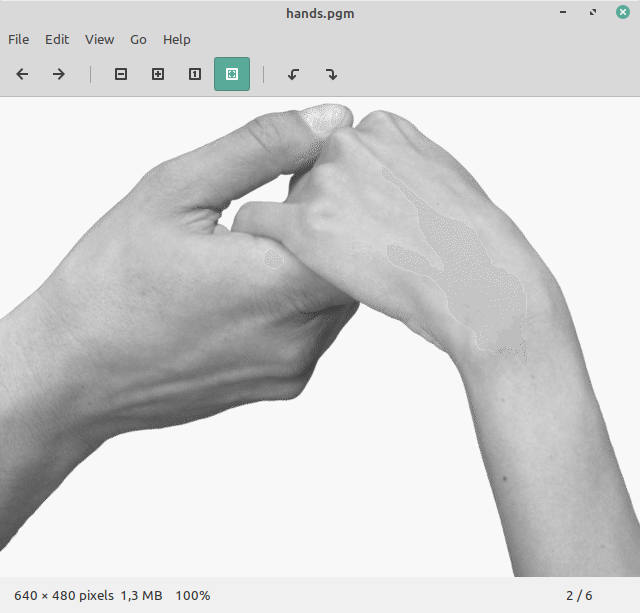
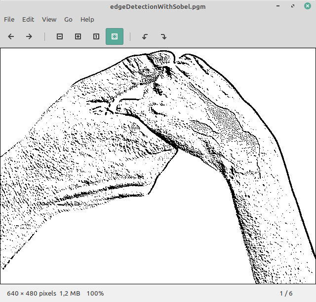
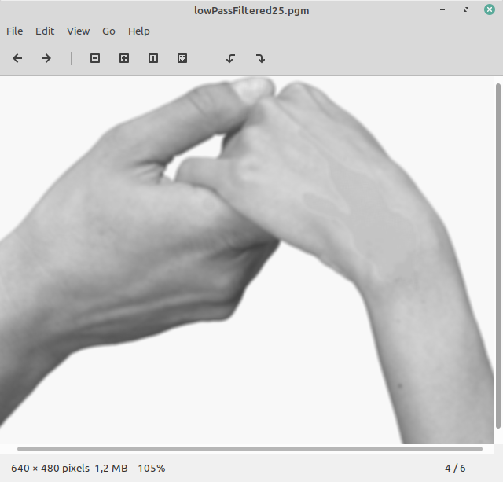

# Image-Processing
  I am working on basic image processing with C Programming Language (for now)
  
  ## Example on hands.pgm
 
 ### Original File 
 
 
 ### Edge Detection With SOBEL 
 
 
 ### Low Pass Filtered
 
 
 
